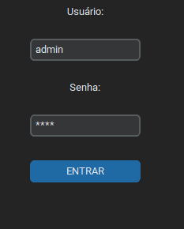

🔐 Sistema de Autenticação com CustomTkinter - Atualizado
Python
CustomTkinter
Pandas
PyMuPDF
Pillow

Um sistema completo de login com interface moderna, validação de dados, 
armazenamento em CSV e visualização de PDF, navegação e histórico completo.

✨ Novas Funcionalidades
🔄 Botão "Voltar ao Início" 

📚 Histórico completo de envios anteriores

🖼️ Visualização aprimorada de PDFs

🏗️ Hierarquia de janelas melhor organizada

🎨 Interface mais intuitiva com navegação fluida

🛠️ Stack Tecnológica Atualizada
Tecnologia	Versão	Finalidade	Ícone
Python	3.11+	Linguagem base	
CustomTkinter	5.2.2	Interface gráfica moderna	
Pandas	2.1.4	Manipulação de dados	
PyMuPDF	1.23.8	Visualização de PDF	
Pillow	10.1.0	Processamento de imagens	
🚀 Como Executar 
# Clone o repositório
git clone https://github.com/seu-usuario/sistema-login-pdf.git
cd sistema-login-pdf

# Instale as dependências (incluindo novas)
pip install PyMuPDF pillow pandas customtkinter

# Execute o sistema
python app.py
📂  Estrutura do Projeto
sistema-login-pdf/
├── app.py                
├── requirements.txt      
├── dados.csv             
├── pdf_anexos/           
├── assets/              
│  
└── README.md   

🆕 Guia de Navegação
Tela de Login:

Credenciais padrão: admin/1234

Formulário Principal:

Visualização de PDF antes do envio

Novo botão "Histórico" e "Voltar"

Histórico:

Lista completa de envios

Visualização de PDFs antigos

Visualizador de PDF:

Botão de voltar para o histórico

🛠️ Personalização Avançada
python
# Configurações personalizáveis no código
TEMA_APLICATIVO = "dark"  # dark, light, system
COR_PRIMARIA = "#1e5387"   # Azul personalizado
TAMANHO_MAX_PDF = 10       # Em MB (aumentado de 5)
🤝 Como Contribuir
Reporte bugs através de Issues

Envie Pull Requests com melhorias

Sugira novos recursos

📄 Licença
MIT License - Disponível para uso comercial e pessoal.

Desenvolvido com ❤️ por Tatiana Kami | Documentação Completa | Changelog
